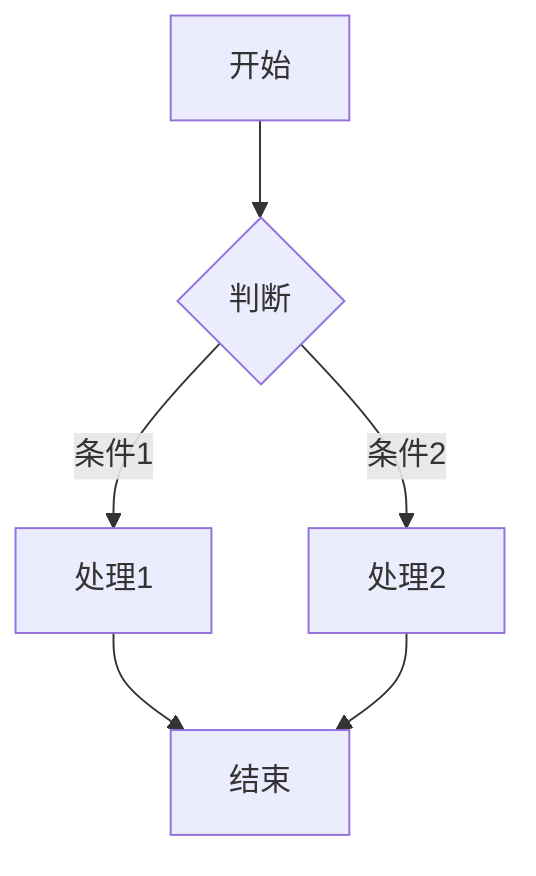
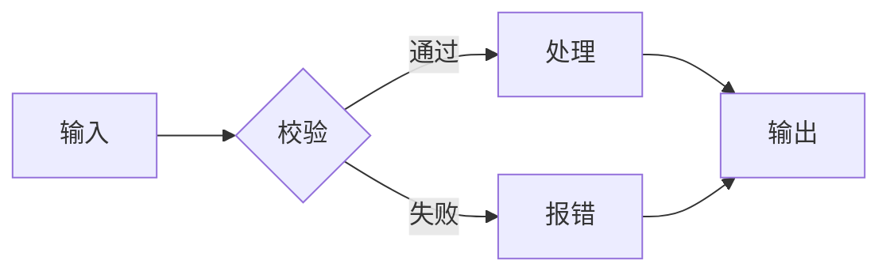
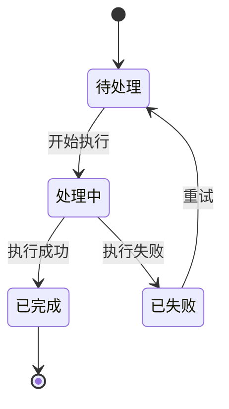
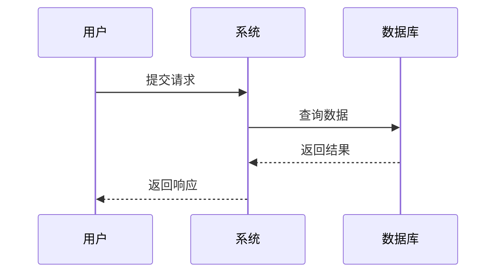
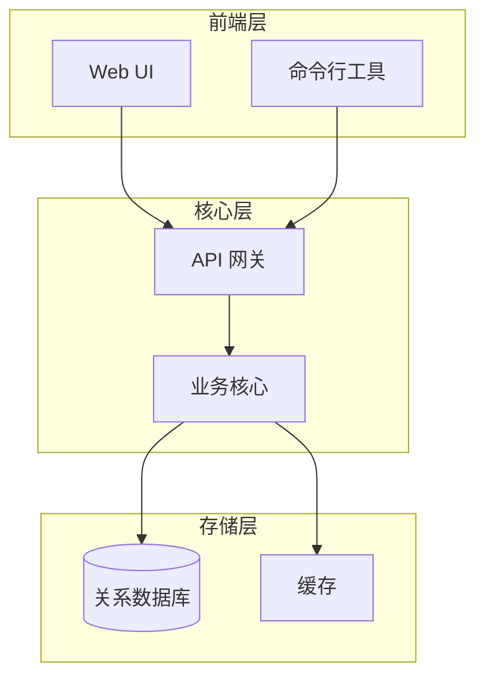
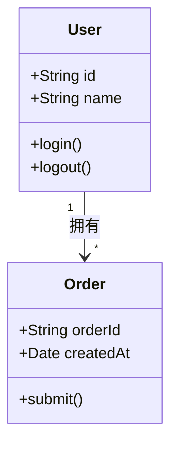
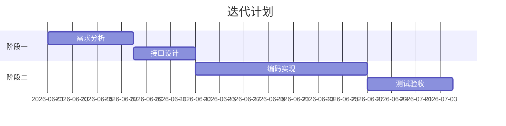
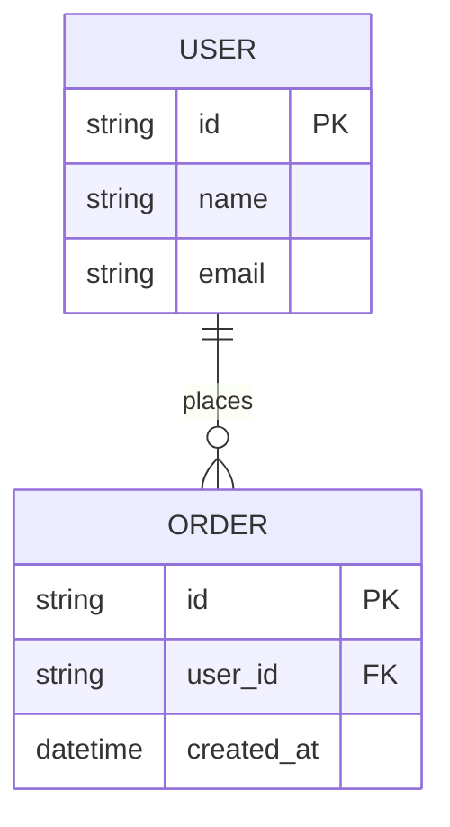

# Mermaid 图表规范

## 核心原则

**所有图表必须使用 Mermaid 语法嵌入 Markdown，禁止以图片形式存在。**

- ❌ 禁止生成 `.png`、`.svg`、`.jpg` 等图片文件
- ❌ 禁止引用外部图片链接（包括 URL 或相对路径图片）
- ✅ 必须使用 Markdown 代码块 + `mermaid` 标识符嵌入图表
- ✅ 图表源码与文档文本共存，版本可控、diff 友好

## 何时使用图表

遇到以下场景时，必须优先使用 Mermaid 图表替代文字描述：

| 场景 | 推荐图表类型 |
|------|-------------|
| 流程、步骤、操作顺序 | flowchart（流程图） |
| 系统/应用架构、模块关系 | flowchart / graph（架构图） |
| 状态转换、生命周期 | stateDiagram（状态机） |
| 时序、交互过程 | sequenceDiagram（时序图） |
| 类结构、继承关系 | classDiagram（类图） |
| 项目计划、迭代排期 | gantt（甘特图） |
| 实体关系、数据模型 | erDiagram（ER 图） |
| 用户旅程、体验地图 | journey（用户旅程图） |
| 思维导图、层次结构 | mindmap（思维导图） |

## 嵌入格式

所有 Mermaid 图表必须使用标准 Markdown 代码块，语言标识符为 `mermaid`：

````markdown

````

## 常用模板

### 1. 流程图（Flowchart）

用于描述业务流程、算法步骤、操作流程。



方向选择：`LR`（左→右）、`TD/TB`（上→下）、`RL`（右→左）、`BT`（下→上）。

### 2. 状态机（State Diagram）

用于描述状态转换、生命周期、协议状态。



### 3. 时序图（Sequence Diagram）

用于描述模块/系统/角色之间的交互时序。



### 4. 架构图（Graph）

用于描述系统组件关系、模块依赖、分层架构。



### 5. 类图（Class Diagram）

用于描述数据结构、对象关系、接口定义。



### 6. 甘特图（Gantt）

用于项目排期、迭代计划、里程碑规划。



### 7. ER 图（Entity Relationship）

用于描述数据模型、实体关系。



## 质量要求

1. **可读性优先**：节点命名使用中文或清晰的英文，避免缩写
2. **方向一致**：同一份文档中的同类图表保持方向统一
3. **颜色克制**：不滥用样式，默认配色已足够清晰；如需强调，仅对关键节点使用 `classDef`
4. **规模控制**：单张图表节点数不超过 20 个，过复杂时拆分为多张或分层展示
5. **文本完整**：图表必须配文字说明，不可只有图没有解释

## 红线规则

1. **禁止生成图片文件**：任何 `.png`、`.svg`、`.jpg`、`.gif` 等二进制图片文件均不允许作为文档图表产出
2. **禁止引用外部图片**：文档中不允许出现 `` 形式的图片引用
3. **Mermaid 无法表达时**：若遇到 Mermaid 确实无法表达的复杂可视化需求（如精确 UI 原型、照片级示意图），以文字表格或 ASCII 艺术替代，仍不生成图片
