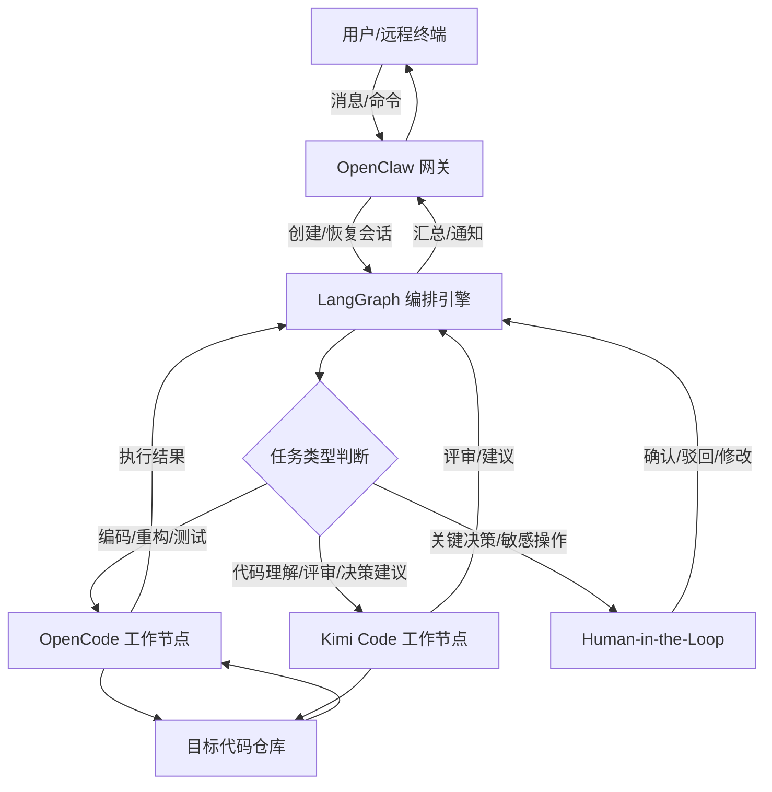
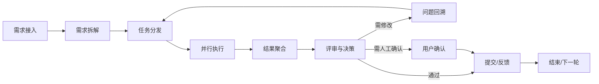

# 多 Agent 协作编程工具链

## 核心原则

1. **单一入口**：所有远程/异步指令统一由 OpenClaw 网关接入，禁止绕过网关直接操作编程 Agent。
2. **编排驱动**：LangGraph 作为状态机与路由中枢，负责任务拆解、循环控制、人机协同节点。
3. **专业分工**：OpenCode 负责代码编辑与工程执行，Kimi Code 负责代码理解、补全与评审，二者互不替代。
4. **人机共决**：关键决策（架构选型、接口变更、代码提交、生产部署）必须引入 Human-in-the-Loop，禁止全自主决策。

## 工具链角色与定位

| 工具 | 角色 | 核心职责 |
|---|---|---|
| OpenClaw | 网关与入口 | 接收远程消息、身份鉴权、会话保持、结果回传、调度子 Agent 会话 |
| LangGraph | 编排引擎 | 定义多 Agent 状态图、节点路由、状态持久化、循环与中断点 |
| OpenCode | 终端编程 Agent | 在本地仓库执行代码编辑、测试运行、重构、Plan/Build 模式落地 |
| Kimi Code | 代码智能 Agent | 代码理解、补全、评审、生成决策建议、辅助编写规范文档 |

## 系统架构



## 协作工作流程



### Step 1：需求接入

- 用户通过 OpenClaw 支持的渠道（Telegram、Discord、Slack、Web 等）提交需求。
- OpenClaw 为每个需求生成唯一 `task_id`，绑定会话上下文与目标仓库。
- 需求描述必须包含：目标、范围、验收标准、期望完成时间。缺失时，LangGraph 应进入澄清节点，向用户追问。

### Step 2：需求拆解

- LangGraph 将需求拆分为可独立验证的子任务。
- 每个子任务必须明确：
  - **输入**：上下文文件、依赖接口、参考规范。
  - **输出**：预期产物（代码、文档、测试、评审意见）。
  - **验收标准**：可检查的通过条件。
  - **负责 Agent**：OpenCode 或 Kimi Code。

### Step 3：任务分发

- LangGraph 根据任务类型路由：
  - 需要修改代码、运行测试、重构 → OpenCode。
  - 需要代码理解、评审、生成决策建议 → Kimi Code。
  - 涉及公共接口、安全、部署 → Human-in-the-Loop。

### Step 4：并行执行

- OpenCode 在 Plan 模式下生成执行方案，经 LangGraph 校验后进入 Build 模式。
- Kimi Code 并行执行代码评审或规范检查。
- 多个 OpenCode 工作节点同时操作同一仓库时，LangGraph 必须通过分支锁或工作副本隔离写冲突。

### Step 5：结果聚合

- LangGraph 收集各节点输出：代码变更、测试报告、评审意见。
- 若结果之间存在冲突（如 Kimi Code 评审不通过但 OpenCode 已提交），必须暂停并进入决策节点。

### Step 6：评审与决策

- 自动评审：Kimi Code 检查规范一致性、边界条件、错误处理。
- 自动测试：OpenCode 运行测试并返回结果。
- 决策分支：
  - **通过**：进入提交/反馈。
  - **需修改**：回溯到任务分发。
  - **需人工确认**：向用户展示差异、影响面、建议，等待显式确认。

### Step 7：提交与反馈

- 用户确认后，OpenCode 执行最终提交，遵循 `commit` 技能生成中文 Conventional Commit。
- OpenClaw 将结果摘要回传给远程用户，包括：完成内容、关键决策、待跟进项。

## 远程交互规则

1. **统一入口**：所有远程消息必须通过 OpenClaw 网关进入 LangGraph，禁止直接暴露 OpenCode/Kimi Code 的终端/接口。
2. **上下文绑定**：每条远程指令必须携带 `task_id`、`session_id`、`repo_path`，缺失则拒绝执行。
3. **异步确认**：长时间任务（>30 秒）必须先返回"已接收"确认，再异步推送进度。
4. **权限分层**：
   - 只读查询：允许直接执行。
   - 文件修改：需要 LangGraph 自动校验影响范围。
   - 提交/部署/敏感操作：必须等待用户显式确认。
5. **结果回传**：所有结果必须经过 OpenClaw 网关，按渠道格式返回，禁止 Agent 直接向用户发送未经验证的原始输出。

## 需求与决策规则

### 需求澄清

- 目标、范围、验收标准任一项缺失 → 进入澄清节点，向用户追问。
- 用户一次性提出多个需求 → 拆分为独立 `task_id`，串行或并行处理，避免上下文污染。

### 决策节点

LangGraph 状态机中必须包含以下决策节点：

| 节点 | 触发条件 | 默认动作 |
|---|---|---|
| `human_review` | 公共接口变更、破坏性改动、安全相关代码 | 暂停，等待用户确认 |
| `auto_merge` | 仅影响单文件、测试全部通过、无公共接口变更 | 自动合并，但记录日志 |
| `rollback` | 测试失败、评审不通过、用户明确拒绝 | 回滚变更，返回问题描述 |

### 决策信息模板

向用户请求确认时，必须包含：

```markdown
- **任务ID**：{task_id}
- **变更摘要**：{一句话描述}
- **影响范围**：{文件列表/接口列表}
- **测试结果**：{通过/失败，关键指标}
- **建议动作**：{提交/修改/放弃}
- **风险说明**：{潜在风险与回滚方式}
```

## 执行规范

### OpenCode 执行规范

1. **Plan 先行**：所有代码修改必须先进入 Plan 模式生成方案，禁止直接 Build。
2. **影响隔离**：每个子任务在独立分支或工作副本上执行，禁止直接修改 `main`/`master`。
3. **测试必跑**：Build 完成后必须运行相关测试，未通过不得进入评审节点。
4. **变更最小**：每个子任务只处理一件事，避免大杂烩提交。

### Kimi Code 执行规范

1. **只读优先**：默认以只读方式理解代码和生成建议，不直接修改文件。
2. **评审清单**：每次评审至少覆盖：接口签名、边界条件、错误处理、命名规范、性能影响。
3. **决策有据**：生成决策建议时必须引用代码位置或规范条款。

## 红线规则

1. **禁止绕过网关**：任何远程指令不得直接调用 OpenCode 或 Kimi Code 的本地接口。
2. **禁止未审提交**：未通过评审或未经用户确认的代码不得自动提交或合并。
3. **禁止无状态并发**：多 Agent 同时写同一仓库时，必须加锁或隔离，禁止裸并发。
4. **禁止隐式高权限**：涉及 `git push`、部署、删除分支、修改 CI/Secrets 的操作必须显式请求用户确认。
5. **禁止上下文泄漏**：不同 `task_id` 的上下文不得混用，防止提示注入或决策污染。

## 质量门禁

| 检查项 | 标准 |
|---|---|
| 需求完整 | 每个任务都有目标、范围、验收标准 |
| 工具链角色清晰 | OpenClaw/LangGraph/OpenCode/Kimi Code 职责不重叠 |
| 状态机完整 | LangGraph 包含 `human_review`、`auto_merge`、`rollback` 节点 |
| 代码评审通过 | Kimi Code 评审清单全部覆盖 |
| 测试通过 | OpenCode 执行的相关测试无失败 |
| 变更可回滚 | 每个子任务在独立分支/副本，保留原始状态 |
| 日志可审计 | 所有远程指令、决策、结果均有 `task_id` 可追溯 |

## 触发条件

当以下任一条件满足时，启用本技能：

- 用户提到"多 Agent 协作编程"、"远程编程 Agent"、"OpenClaw + OpenCode"、"LangGraph 编排"。
- 任务需要在 OpenClaw、LangGraph、OpenCode、Kimi Code 之间进行组合调度。
- 任务涉及远程提交需求、跨 Agent 分发任务、代码评审与决策。

## 示例

### 示例 1：远程重构请求

用户在 Telegram 发送："把用户认证模块重构为 JWT。"

1. OpenClaw 接收消息，生成 `task_id=auth-jwt-001`，绑定仓库。
2. LangGraph 进入需求澄清节点：确认范围（是否包含前端、测试）、JWT 算法、密钥管理方式。
3. 用户确认后，拆分为：
   - 子任务 A：后端接口改造（OpenCode）
   - 子任务 B：新认证流程评审（Kimi Code）
4. OpenCode 在 Plan 模式输出方案，经 `human_review` 确认后 Build。
5. Kimi Code 评审代码，提出边界条件补充。
6. OpenCode 补充后测试通过，LangGraph 汇总结果。
7. 用户确认提交，OpenCode 生成提交消息并推送。
8. OpenClaw 向用户返回完成摘要。

### 示例 2：多 Agent 并行评审

用户发送："请让多个 Agent 同时评审这个新接口设计。"

1. OpenClaw 接入需求，LangGraph 分发多个 Kimi Code 实例并行评审。
2. 每个实例关注不同维度：安全性、性能、可维护性、边界条件。
3. LangGraph 聚合评审意见，冲突处进入 `human_review`。
4. 汇总结果回传用户，由用户决定是否修改。
