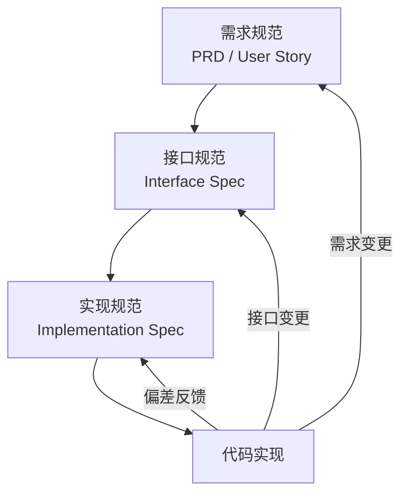

# 规范驱动开发

## 核心原则

**规范是代码的契约。无规范，不编码。**

任何功能、模块、接口在被实现之前，必须先产出对应的规范文档。规范文档是开发的唯一依据，代码必须与规范保持一致。

## 规范层级



| 层级 | 内容 | 产出物 | 评审人 |
|------|------|--------|--------|
| 需求规范 | 功能目标、用户场景、验收标准 | PRD / User Story | 产品经理 + 用户 |
| 接口规范 | 输入输出、数据结构、错误码、边界条件 | `SPEC.md` / OpenAPI | 架构师 + 消费者 |
| 实现规范 | 算法逻辑、状态机、数据流、关键决策 | `IMPL.md` | 技术负责人 |

## 规范文档格式

### 接口规范模板（`SPEC.md`）

每个模块/功能必须包含：

```markdown
# {模块名} 接口规范

## 1. 概述
- 目标：一句话描述该模块解决什么问题
- 范围：做什么、不做什么
- 依赖：依赖哪些外部模块或服务

## 2. 接口定义

### {接口名}
- **功能**：该接口做什么
- **输入**：
  - `{参数名}`: `{类型}` — 描述，是否必填，默认值，约束条件
- **输出**：
  - `{字段名}`: `{类型}` — 描述
- **错误码**：
  - `ERROR_XXX`: 描述及触发条件
- **边界条件**：
  - 空输入时返回什么
  - 超大输入时如何处理
  - 并发调用时行为

## 3. 数据结构

## 4. 状态机（如有）

## 5. 验收标准
- [ ] 条件1
- [ ] 条件2
```

### 实现规范模板（`IMPL.md`）

```markdown
# {模块名} 实现规范

## 1. 算法/逻辑概述
## 2. 关键决策
- 为什么选方案 A 而非方案 B
## 3. 异常处理策略
## 4. 性能考量
## 5. 测试策略
- 需要覆盖的场景列表
```

## 工作流程

### Step 1：编写规范
- 根据 PRD 拆解为接口规范和实现规范
- 规范必须包含输入输出定义、边界条件、错误处理
- 复杂逻辑必须配 Mermaid 流程图或状态机图

### Step 2：规范评审
- 逐条检查规范是否完整覆盖需求
- 检查边界条件是否遗漏
- 检查错误处理是否完备
- **评审不通过 → 退回修改，禁止进入编码阶段**

### Step 3：按规范编码
- 代码结构必须与规范一致
- 函数签名必须与规范一致
- 错误码必须与规范一致
- 边界处理必须与规范一致

### Step 4：规范一致性检查
- 代码完成后，对照规范逐条核对
- 发现偏差 → 要么修改代码，要么升级规范（需重新评审）

## 红线规则

1. **无规范文件不创建源码文件**：发现 `src/` 目录下存在没有对应 `SPEC.md` 的模块，立即标记为违规
2. **接口变更必须同步更新规范**：代码中的接口签名、错误码、数据结构发生变更，必须在 1 个 commit 内同步更新规范文档
3. **规范与代码不一致视为 Bug**：测试发现规范与代码行为不一致时，以规范为准修复代码，或以代码为准升级规范并重新评审
4. **禁止口头约定替代书面规范**：任何接口契约必须以文档形式固化，禁止"这个我们私下说好了"的约定

## 质量门禁

| 检查项 | 标准 |
|--------|------|
| 规范覆盖率 | 每个 `pub` 接口必须有规范文档 |
| 边界条件覆盖 | 每个接口至少列出 3 个边界场景 |
| 错误码完整 | 所有错误路径都有对应的错误码和描述 |
| 规范-代码一致性 | 100% 一致，偏差必须记录原因 |
