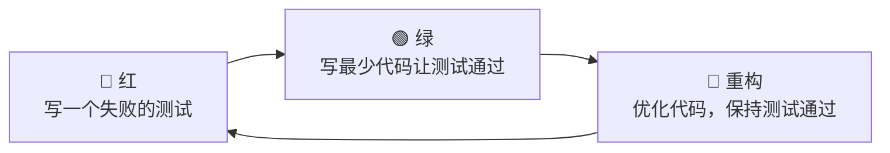
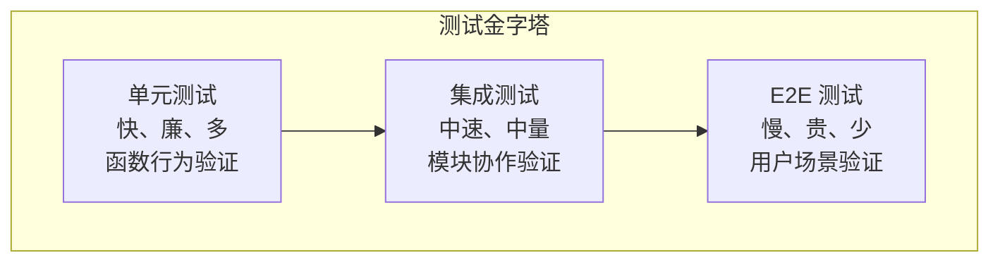

# 测试驱动开发

## 核心原则

**测试是需求的具体化。先写测试，后写实现。**

TDD 不是"写完代码补测试"，而是"测试定义行为，代码满足测试"。

## 红绿重构循环



### Step 1：红 — 写一个失败的测试
- 测试名称精确描述被测行为
- 测试先失败（验证测试本身有效）
- 测试覆盖一个且仅一个行为点
- 测试不依赖外部状态，使用 Mock/Stub 隔离依赖

### Step 2：绿 — 写最少代码让测试通过
- 目标：测试变绿，仅此而已
- 允许写"丑陋"的实现，先满足测试
- 不允许跳过失败测试直接写实现

### Step 3：蓝 — 重构
- 在不改变行为的前提下优化代码结构
- 测试持续保持绿色
- 重构后立即提交（小步提交）

## 测试类型与层级



| 类型 | 范围 | 速度 | 数量 | 工具示例 |
|------|------|------|------|----------|
| 单元测试 | 单个函数/方法 | < 10ms | 大量（80%+） | Rust: `#[test]` + `rstest` |
| 集成测试 | 模块间协作 | < 100ms | 中等（15%） | Rust: `tests/` 目录 |
| E2E 测试 | 完整用户流程 | > 1s | 少量（5%） | CLI: assert_cmd, Desktop: Playwright |

## 测试编写规范

### FIRST 原则

| 字母 | 含义 | 要求 |
|------|------|------|
| **F**ast | 快速 | 单元测试必须在 10ms 内完成 |
| **I**ndependent | 独立 | 测试之间不共享状态，执行顺序无关 |
| **R**epeatable | 可重复 | 任何时间、任何环境运行结果一致 |
| **S**elf-validating | 自验证 | 测试通过/失败必须明确，不依赖人工检查输出 |
| **T**imely | 及时 | 与实现代码同时编写，最晚在提交前完成 |

### 测试命名规范

测试函数名必须描述行为，而非被测对象：

```rust
// ❌ 坏：只描述被测对象
fn test_workspace_manager() {}

// ✅ 好：描述具体行为
fn create_workspace_should_persist_to_disk() {}
fn switch_workspace_should_pause_previous_tasks() {}
fn add_duplicate_file_should_return_existing_document_id() {}
```

### Arrange-Act-Assert 结构

每个测试必须清晰分为三段：

```rust
#[test]
fn search_should_return_results_sorted_by_relevance() {
    // Arrange: 准备测试数据
    let engine = IndexEngine::new(temp_dir()).unwrap();
    engine.index_document(doc_a).await.unwrap();
    engine.index_document(doc_b).await.unwrap();

    // Act: 执行被测操作
    let results = engine.search_text("keyword", 10).await.unwrap();

    // Assert: 验证结果
    assert_eq!(results.len(), 2);
    assert!(results[0].score > results[1].score);
}
```

### 边界条件测试清单

每个接口必须覆盖以下场景（至少）：

| 场景 | 示例 |
|------|------|
| 空输入 | `search("")` 返回什么 |
| 超大输入 | `index_document(1GB_file)` 如何处理 |
| 无效输入 | `create_workspace("/invalid/path")` 返回什么错误 |
| 并发场景 | 两个线程同时创建同名工作空间 |
| 资源耗尽 | 磁盘满时导入文件的行为 |
| 依赖失败 | AI 服务不可用时对话的降级策略 |

## Mock 与依赖隔离

### 必须 Mock 的场景

- 外部 HTTP 服务（AI API、Embedding 服务）
- 文件系统操作（使用临时目录替代真实路径）
- 时间相关逻辑（使用注入的 Clock）
- 随机数生成（使用注入的 Random）

### Mock 原则

- Mock 接口，不 Mock 实现细节
- 一个测试只 Mock 直接依赖，不连锁 Mock
- Mock 验证交互次数和参数，不验证内部调用链

## 覆盖率门禁

| 层级 | 最低覆盖率 | 目标覆盖率 |
|------|-----------|-----------|
| 单元测试 | 70% | 85% |
| 集成测试 | 核心流程必须覆盖 | 所有 pub 接口 |
| E2E 测试 | CLI 主要命令 | Desktop 核心流程 |

**覆盖率不追求完美，追求有效**：100% 行覆盖率但测试无断言 = 无效测试。

## 红线规则

1. **禁止无测试提交**：任何新增 `pub` 函数必须有对应的单元测试，任何 Bug 修复必须有回归测试
2. **禁止注释掉失败测试**：测试失败必须修复，不允许通过注释测试让 CI 通过
3. **禁止测试依赖真实外部服务**：所有外部依赖必须 Mock 或使用测试替身
4. **禁止测试私有函数**：私有函数通过公有接口间接测试，除非逻辑极其复杂
5. **禁止测试与实现同时编写**：必须是"先测试红 → 后实现绿"的顺序，不能先写实现再补测试

## CI 集成

```yaml
# GitHub Actions 示例
test:
  steps:
    - run: cargo test --all-features
    - run: cargo tarpaulin --out Xml --fail-under 70
    - run: cargo clippy --all-targets --all-features -- -D warnings
```

| 门禁 | 失败处理 |
|------|----------|
| 编译失败 | 阻止合并 |
| Clippy warning | 阻止合并 |
| 测试失败 | 阻止合并 |
| 覆盖率 < 70% | 阻止合并 |
