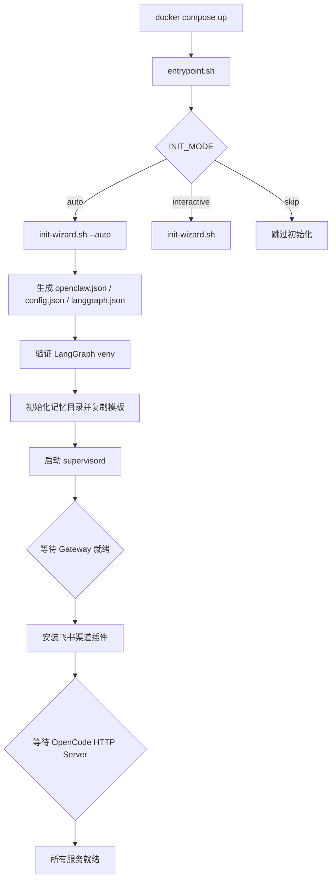
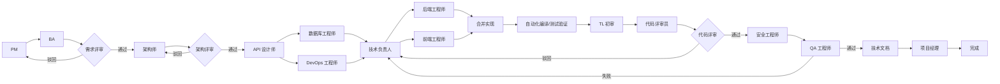

# 多 Agent 工具链 Docker 部署说明

本目录包含多 Agent 协作编程工具链的完整 Docker 化部署方案，集成 OpenClaw（网关）、OpenCode（终端编程 Agent）和 LangGraph（编排引擎），支持 13 个 AI 角色协作完成自动化编程工作流。

---

## 前置要求

- Docker Engine >= 24.0
- Docker Compose >= 2.20
- 至少 6GB 可用内存（容器默认限制 `mem_limit: 6g`）
- 已配置 `.env` 文件（从 `.env.example` 复制并填写）

---

## 快速开始

```bash
cd docker

# 1. 复制环境变量模板并编辑
cp .env.example .env
# 编辑 .env，至少填写 KIMI_API_KEY 或 DEEPSEEK_API_KEY

# 2. 启动容器（会自动完成首次初始化）
docker compose up -d

# 3. 查看日志
docker compose logs -f agent-toolchain

# 4. 验证健康检查
curl http://127.0.0.1:18789/health
```

---

## 镜像构建

### 前置步骤：更新版本号

所有组件版本统一记录在 `VERSIONS` 文件中，为单一事实来源。构建前先修改此文件：

```bash
# VERSIONS
OPENCLAW_VERSION=2026.6.6
OPENCODE_VERSION=1.17.7
FEISHU_PLUGIN_VERSION=2026.6.6
LANGGRAPH_CLI_VERSION=0.4.29
LANGGRAPH_CHECKPOINT_SQLITE_VERSION=3.1.0
```

### 构建本地镜像

构建时必须将 `VERSIONS` 中的版本号通过 `--build-arg` 传入，否则会使用 Dockerfile 中的旧默认值：

```bash
cd docker

# 从 VERSIONS 文件读取版本并传入构建参数
source VERSIONS && docker build \
  --build-arg OPENCLAW_VERSION=$OPENCLAW_VERSION \
  --build-arg OPENCODE_VERSION=$OPENCODE_VERSION \
  --build-arg FEISHU_PLUGIN_VERSION=$FEISHU_PLUGIN_VERSION \
  -t luowenqiang/ai-coding-tools:latest .
```

也可手动指定：

```bash
docker build \
  --build-arg OPENCLAW_VERSION=2026.6.6 \
  --build-arg OPENCODE_VERSION=1.17.7 \
  --build-arg FEISHU_PLUGIN_VERSION=2026.6.6 \
  -t luowenqiang/ai-coding-tools:latest .
```

构建产物：

| 组件 | 说明 |
|---|---|
| 基础镜像 | `node:24-slim` |
| OpenClaw | `openclaw@$(OPENCLAW_VERSION)`（含飞书渠道插件） |
| OpenCode | `opencode-ai@$(OPENCODE_VERSION)` |
| LangGraph | Python venv `/opt/langgraph/.venv`（`langgraph-cli==$(LANGGRAPH_CLI_VERSION)`、`openai`、`pillow` 等） |
| 配置模板 | `/etc/templates/`（openclaw.json / opencode-config.json / langgraph.json / 记忆模板 / 工作流源码） |
| 入口脚本 | `/usr/local/bin/entrypoint.sh` |
| 初始化向导 | `/usr/local/bin/init-wizard.sh` |
| 工具脚本 | `opencode-tool`、`langgraph-trigger`、`langgraph-resume` |

### 通过 Docker Compose 构建

`docker-compose.yml` 默认直接引用已构建镜像。如需让 compose 自动构建，在 `services.agent-toolchain` 下添加 `build` 段：

```yaml
build:
  context: .
  dockerfile: Dockerfile
```

然后执行：

```bash
source ../VERSIONS && docker compose build \
  --build-arg OPENCLAW_VERSION=$OPENCLAW_VERSION \
  --build-arg OPENCODE_VERSION=$OPENCODE_VERSION \
  --build-arg FEISHU_PLUGIN_VERSION=$FEISHU_PLUGIN_VERSION
docker compose up -d
```

---

## 卷映射说明

`docker-compose.yml` 将主机目录挂载到容器 `/data` 下各子目录。建议将实际开发项目挂载到 `CODE_DIR`。

| 主机路径 | 容器路径 | 用途 |
|---|---|---|
| `./data/openclaw` | `/data/openclaw` | OpenClaw 运行时配置（`openclaw.json`）、会话、Skills |
| `./data/opencode` | `/data/opencode` | OpenCode 配置（`.config/opencode/config.json`） |
| `./data/langgraph` | `/data/langgraph` | LangGraph 工作流源码与 `langgraph.json` 配置 |
| `./data/memory` | `/data/memory` | 三层记忆文件（全局 MEMORY.md / 会话 / 任务）+ 每日笔记 |
| `./data/logs` | `/data/logs` | supervisord / openclaw / opencode / langgraph 日志 |
| `${PHOTOS_DIR:-./data/photos}` | `/data/photos` | 照片/多媒体数据（照片分拣工作流使用） |
| `${CODE_DIR:-./data/code}` | `/data/code` | **代码仓库工作目录**（Agent 在此执行代码修改） |
| `${KNOWLEDGE_DIR:-./data/knowledge}` | `/data/knowledge` | 知识库文档 |

### 关键文件说明

| 文件 | 说明 |
|---|---|
| `./data/openclaw/.openclaw/openclaw.json` | OpenClaw 运行时配置（含 16 个 Agent 定义、模型、渠道），由 `init-wizard.sh` 自动生成 |
| `./data/opencode/.config/opencode/config.json` | OpenCode 配置（仅 `model` 字段），向导生成 |
| `./data/.initialized` | 初始化完成标记，删除后下次启动重新进入初始化流程 |
| `./data/.env` | 运行时环境变量，由向导生成，supervisord 子进程继承 |
| `./data/memory/MEMORY.md` | 长期记忆（用户偏好、技术栈、决策、经验教训） |
| `./data/memory/USER.md` | 用户信息 |
| `./data/memory/SOUL.md` | Agent 人格定义 |
| `./data/memory/AGENTS.md` | 操作规范 |

首次启动时会从 `/etc/templates/memory/` 复制缺失的记忆模板文件到挂载卷中，确保即使 NAS 挂载路径为空也能自动初始化。

---

## 初始化流程

### 四种模式

通过 `INIT_MODE` 环境变量控制：

| 模式 | 行为 |
|---|---|
| `auto`（推荐） | 从 `.env` 环境变量读取 LLM 配置，自动渲染模板，无需人工干预 |
| `interactive` | 首次启动进入中文交互向导（需 `docker attach` 到容器终端） |
| `skip` | 跳过初始化向导（适用于已配置好配置文件的情况） |
| `reset` | 清除 `data/.initialized` 标记，重新进入交互向导 |

### 自动初始化（Auto 模式）

`auto` 模式从 `.env` 读取以下必要变量：

```env
INIT_MODE=auto
PROVIDER_NAME=deepseek           # 或 kimi / opencode / openai / anthropic / 自定义
PROVIDER_BASE_URL=https://api.deepseek.com/v1
PROVIDER_API_TYPE=openai-completions
MODEL_ID=deepseek-v4-flash
MODEL_NAME=DeepSeek V4 Flash
PRIMARY_MODEL=deepseek/deepseek-v4-flash
# 三选一即可（优先级：OPENCODE_ZEN_API_KEY > KIMI_API_KEY > DEEPSEEK_API_KEY）
DEEPSEEK_API_KEY=sk-xxx
```

仅 `KIMI_API_KEY` 或 `DEEPSEEK_API_KEY` 中至少一个不为空即可。`API_KEY` 会自动回退。

初始化向导自动执行：

1. 回退确认 `API_KEY`（`${OPENCODE_ZEN_API_KEY:-${KIMI_API_KEY:-${DEEPSEEK_API_KEY}}}`）
2. OpenCode 模型自动映射：
   - `PROVIDER_NAME=opencode` → `OPENCODE_PRIMARY_MODEL=opencode/gpt-5.1-codex`
   - `PROVIDER_NAME=kimi`     → `OPENCODE_PRIMARY_MODEL=kimi-for-coding/k2p5`
   - 其他 provider            → `OPENCODE_PRIMARY_MODEL=$PRIMARY_MODEL`
3. 生成 Gateway Token（`openssl rand -hex 16`）
4. 加载各角色模型（`ROLE_*_MODEL`），默认全部使用 `PRIMARY_MODEL`
5. 处理飞书/Telegram 渠道配置
6. 通过 `sed` 替换 `${VAR}` 占位符，渲染所有配置模板
7. 安装 Skills（`skills-list.txt` 中定义）
8. 创建 `data/.initialized` 标记文件

### 交互初始化（Interactive 模式）

适合首次部署调试。启动后 `docker attach` 到容器即可按步骤配置：

```bash
docker compose up -d
docker attach agent-toolchain
# 按 Ctrl+P Ctrl+Q 安全分离
```

交互步骤：选择提供商 → 配置 Gateway → 配置飞书 → 配置 Telegram → 安装 Skills → 生成配置。

### 重初始化

```bash
docker compose down -v
rm -f data/.initialized
docker compose up -d
```

---

## 容器启动流程



entrypoint.sh（`docker/scripts/entrypoint.sh`）按顺序执行：

1. 加载 `/data/.env` 环境变量
2. 根据 `INIT_MODE` 执行初始化向导（`init-wizard.sh`）
3. 验证 LangGraph Python 虚拟环境完整性，损坏则重建
4. 初始化 `/data/memory/` 目录结构（`session/`、`tasks/`、`daily/`）
5. 从 `/etc/templates/memory/` 复制缺失的记忆模板（MEMORY.md / USER.md / SOUL.md / AGENTS.md）
6. 将 OpenCode 配置同步到 OpenClaw 用户的 HOME
7. 后台启动 supervisord（管理 openclaw、opencode、langgraph 三个进程）
8. 等待 OpenClaw Gateway 就绪后，安装飞书渠道插件
9. 等待 OpenCode HTTP Server 就绪（LangGraph 工作流依赖它执行编码任务）
10. 将 supervisord 带回前台，确保信号正确传递

---

## 服务架构

```mermaid
graph TD
    A[用户 / 远程渠道] -->|HTTP/WebSocket| B[OpenClaw Gateway<br/>:18789]
    B -->|本地 exec / opencode-tool| C[OpenCode<br/>:4096]
    B -->|HTTP| D[LangGraph Server<br/>:8000]
    C -->|读写| E[/data/code]
    D -->|调用 OpenCode HTTP API| E
    D -->|调用 OpenClaw Gateway API| B
    B -->|持久化| F[/data/openclaw]
    C -->|配置| G[/data/opencode]
    D -->|源码与配置| H[/data/langgraph]
    D -->|读写| I[/data/memory]
```

### 三个核心服务

| 服务 | 端口 | 进程管理 | 职责 |
|---|---|---|---|
| **OpenClaw Gateway** | 18789 | supervisord | 网关/路由，统一 API 入口，管理 16 个 Agent + 16 个模型映射，渠道集成 |
| **OpenCode** | 4096 | supervisord | 终端编程 Agent，HTTP Server 模式供 LangGraph 调用执行编码任务 |
| **LangGraph Server** | 8000 | supervisord | 工作流编排引擎，运行 `auto_programming` 等图工作流 |

---

## 环境变量说明

### 必填（自动初始化模式）

| 变量 | 说明 | 示例 |
|---|---|---|
| `INIT_MODE` | 初始化模式 | `auto` |
| `PROVIDER_NAME` | LLM provider 名称（英文小写） | `kimi` / `opencode` / `deepseek` / `openai` |
| `PROVIDER_BASE_URL` | provider API base URL（内置 provider 可留空） | `https://api.kimi.com/coding/` |
| `PROVIDER_API_TYPE` | API 协议类型 | `anthropic-messages` / `openai-completions` / `openai-responses` |
| `MODEL_ID` | 模型 ID | `kimi-for-coding` / `gpt-5.1-codex` |
| `MODEL_NAME` | 模型显示名称 | `Kimi Code` / `OpenCode Zen GPT 5.1 Codex` |
| `PRIMARY_MODEL` | OpenClaw 使用的 `provider/model` 格式 | `kimi/kimi-for-coding` |
| `API_KEY` / `OPENCODE_ZEN_API_KEY` / `KIMI_API_KEY` / `DEEPSEEK_API_KEY` | API 密钥（至少一个） | `sk-...` |

### 可选

| 变量 | 默认值 | 说明 |
|---|---|---|
| `OPENCLAW_GATEWAY_PORT` | 18789 | Gateway 端口 |
| `OPENCLAW_GATEWAY_TOKEN` | 自动生成 | Gateway 认证 Token（32 位 hex） |
| `LANGGRAPH_PORT` | 8000 | LangGraph Server 端口 |
| `LANGGRAPH_PERSISTENCE` | true | 启用 SQLite checkpoint 持久化 |
| `LANGGRAPH_CHECKPOINT_PATH` | `/data/langgraph/checkpoints.sqlite` | checkpoint 文件路径 |
| `OPENCODE_PORT` | 4096 | OpenCode HTTP Server 端口 |
| `OPENCODE_SERVER_PASSWORD` | 空 | OpenCode HTTP Basic Auth 密码（内网通信可留空） |
| `OPENCODE_SKIP_PERMISSIONS` | true | 是否开启 `--dangerously-skip-permissions`（自动化建议开启） |
| `OPENCODE_PRIMARY_MODEL` | 自动映射 | OpenCode 模型名（`opencode/gpt-5.1-codex` / `kimi-for-coding/k2p5`） |
| `ROLE_*_MODEL` | PRIMARY_MODEL | 13 个角色各自的模型，可单独指定 |
| `ENABLE_SECURITY_REVIEW` | false | 启用安全评审节点 |
| `ENABLE_API_REVIEW` | false | 启用 API 评审节点 |
| `OPENAI_API_KEY` / `OPENAI_BASE_URL` / `ANTHROPIC_API_KEY` / `MOONSHOT_API_KEY` | - | 其他 provider key 或 OpenAI 兼容端点 |
| `OPENCODE_ZEN_API_KEY` | - | OpenCode Zen API Key（https://opencode.ai/auth 获取） |
| `FEISHU_APP_ID` / `FEISHU_APP_SECRET` / `FEISHU_VERIFICATION_TOKEN` | - | 飞书渠道配置 |
| `FEISHU_NOTIFY_WEBHOOK` | - | HITL 通知 webhook（可选） |
| `FEISHU_NOTIFY_SECRET` | - | 飞书自定义机器人签名密钥（可选，建议开启） |
| `TELEGRAM_BOT_TOKEN` / `TELEGRAM_CHAT_ID` | - | Telegram 渠道与 HITL 通知配置 |
| `PHOTOS_DIR` / `CODE_DIR` / `KNOWLEDGE_DIR` | `./data/*` | 业务数据目录（可指向 NAS 路径） |

### 推荐 Kimi Code 配置

```env
INIT_MODE=auto

PROVIDER_NAME=kimi
PROVIDER_BASE_URL=https://api.kimi.com/coding/
PROVIDER_API_TYPE=anthropic-messages
MODEL_ID=kimi-for-coding
MODEL_NAME=Kimi Code
PRIMARY_MODEL=kimi/kimi-for-coding

KIMI_API_KEY=sk-你的-kimi-key
API_KEY=${KIMI_API_KEY}

OPENCLAW_GATEWAY_PORT=18789
LANGGRAPH_PORT=8000

CODE_DIR=./data/code
```

### 推荐 DeepSeek 配置

```env
INIT_MODE=auto

PROVIDER_NAME=deepseek
PROVIDER_BASE_URL=https://api.deepseek.com/v1
PROVIDER_API_TYPE=openai-completions
MODEL_ID=deepseek-v4-flash
MODEL_NAME=DeepSeek V4 Flash
PRIMARY_MODEL=deepseek/deepseek-v4-flash

DEEPSEEK_API_KEY=sk-你的-deepseek-key
API_KEY=${DEEPSEEK_API_KEY}

OPENCLAW_GATEWAY_PORT=18789
LANGGRAPH_PORT=8000

CODE_DIR=./data/code
```

---

## 使用用例

### 用例 1：通过 OpenClaw Gateway 调用主 Agent

```bash
# 获取 Gateway Token
TOKEN=$(jq -r '.gateway.auth.token' data/openclaw/.openclaw/openclaw.json)

# 调用 chat completions
curl http://127.0.0.1:18789/v1/chat/completions \
  -H "Authorization: Bearer $TOKEN" \
  -H "Content-Type: application/json" \
  -d '{
    "model": "openclaw",
    "messages": [{"role": "user", "content": "你好"}],
    "max_tokens": 50
  }'
```

### 用例 2：使用 OpenClaw 本地 Agent 执行编码任务

```bash
docker compose exec agent-toolchain bash

# 进入容器后，直接调用 openclaw agent
export HOME=/data/openclaw
openclaw agent --local --agent main \
  --message '在 /data/code/my-project 下创建一个 Hello World Python Web 应用' \
  --thinking off --timeout 120
```

`openclaw agent` 会通过 `opencode-tool` 包装器调用 OpenCode 来执行实际的编码操作。

### 用例 3：整个工具链自动化编程（LangGraph 工作流）

这是本工具链的核心能力——13 个 AI 角色按瀑布流程协作完成软件开发。

```bash
docker compose exec agent-toolchain bash

# 触发自动化编程工作流
langgraph-trigger \
  --task-title "开发一个 Flask 用户管理 REST API" \
  --task-desc "实现用户注册、登录、CRUD 操作，使用 SQLite 存储" \
  --code-dir "/data/code/user-api" \
  --requirements "Python 3.11+, Flask, SQLite, RESTful"
```

工作流将依次经过以下角色：

```
产品经理 → 业务分析师 → [人工评审断点] → 系统架构师 → [架构评审断点]
→ API 设计师 + 数据库工程师 + DevOps 工程师 (并行)
→ 技术负责人 → 后端工程师 + 前端工程师 (并行)
→ 合并实现 → 自动化编译/测试验证 → TL 初审 → 代码评审员 → [代码评审断点]
→ 安全工程师(可选) → API 评审(可选)
→ 测试工程师 (失败则回到技术负责人，最多重试 3 次) → 技术文档工程师 → 项目经理 → 完成
```

脚本返回 `task_id` 和 `thread_id`，可用于后续查询和恢复。

也可通过 OpenClaw 自定义 skill 使用确定性斜杠命令触发：

```text
/auto-programming 开发一个 Todo 应用 支持任务增删改查与标签筛选
```

该 skill 使用 `command-dispatch: tool` + `command-arg-mode: raw`，参数原样透传，不依赖 LLM 意图判断。

### 用例 4：恢复暂停的工作流（人工介入）

当工作流在评审阶段需要人工介入时，状态变为 `pending_human_review`。审查代码后使用 `langgraph-resume` 恢复：

```bash
docker compose exec agent-toolchain bash

# 批准当前阶段，继续下一阶段
langgraph-resume --thread-id <thread_id> --approve --feedback "架构设计合理，可以继续"

# 或驳回，让 Agent 重新执行
langgraph-resume --thread-id <thread_id> --reject --feedback "需要增加缓存层"
```

#### 飞书通知安全设置（推荐）

在飞书群中添加自定义机器人后，建议开启**签名校验**以提高安全性：

1. 进入群设置 → 群机器人 → 自定义机器人 → 安全设置
2. 开启"签名校验"，复制系统生成的密钥
3. 在 `.env` 中配置：
   ```env
   FEISHU_NOTIFY_WEBHOOK=https://open.feishu.cn/open-apis/bot/v2/hook/xxx
   FEISHU_NOTIFY_SECRET=你的签名密钥
   ```
4. 重启容器生效

配置签名后，LangGraph 发送通知时会自动计算 `timestamp` + `sign`，防止 Webhook 地址泄露后被恶意调用。不配置签名时，仅在飞书未开启签名校验的情况下可用。

### 用例 5：通过飞书/Telegram 远程使用

如果配置了飞书或 Telegram 渠道，可以直接在聊天中发送消息给 Agent：

- **飞书**：向配置的飞书应用发送消息，OpenClaw Gateway 接收并路由到主 Agent
- **Telegram**：向配置的 Bot 发送消息，同样路由到 Agent

Agent 可以通过 `opencode-tool` 调用 OpenCode 执行编码任务。

### 用例 6：照片分拣示例工作流

```bash
docker compose exec agent-toolchain bash
langgraph-trigger-photo-sorter /data/photos /data/photos/sorted
```

整理规则：
- 普通照片按 `yyyyMMdd-地点` 归档；无法识别地点时仅使用 `yyyyMMdd`。
- 截图、证件、发票等图文类照片统一归入 `图文` 目录。
- 处理完成后在目标目录生成 `分拣报告.md`，列出每个目录下的重复文件及相似度超过 90% 的图片对。

若未指定参数，默认源目录为 `/data/photos`，目标目录为 `/data/photos/sorted`。

---

## LangGraph 自动化编程工作流详解

### 工作流概览



### 13 个角色

| 角色 | Agent ID | 职责 |
|---|---|---|
| 主助手 | `main` | 通用 AI 编程助手，响应日常询问 |
| 产品经理 | `pm` | 撰写 PRD、定义功能范围 |
| 业务分析师 | `business_analyst` | 详细需求分析、用户故事、验收标准 |
| 系统架构师 | `system_architect` | 技术选型、系统架构设计 |
| API 设计师 | `api_designer` | API 契约设计（OpenAPI 规范） |
| 数据库工程师 | `database_engineer` | Schema 设计、迁移脚本 |
| 技术负责人 | `tech_lead` | 任务拆解、技术决策、代码初审 |
| 后端工程师 | `backend_engineer` | 后端功能实现 |
| 前端工程师 | `frontend_engineer` | 前端界面实现 |
| DevOps 工程师 | `devops_engineer` | CI/CD 配置、Dockerfile、部署脚本 |
| 代码评审员 | `code_reviewer` | 代码质量评审 |
| 安全工程师 | `security_engineer` | 安全审计（可选节点） |
| QA 工程师 | `qa_engineer` | 测试用例编写与执行 |
| 技术文档工程师 | `technical_writer` | 文档编写 |
| 项目经理 | `project_manager` | 项目验收汇总 |

每个角色使用独立的 LLM 模型配置（通过 `ROLE_*_MODEL` 环境变量控制），可让不同角色使用不同模型。

### LangGraph 工具脚本

| 脚本 | 路径 | 功能 |
|---|---|---|
| `langgraph-trigger` | `/usr/local/bin/langgraph-trigger` | 触发 `auto_programming` 工作流，支持 CLI 参数或 JSON stdin |
| `langgraph-resume` | `/usr/local/bin/langgraph-resume` | 恢复暂停的工作流，传递评审反馈 |

---

## 记忆系统

容器内置三层记忆系统，由 `/data/langgraph/src/memory.py` 实现，工作流通过 `src.memory` 模块统一访问：

| 层级 | 存储位置 | 说明 |
|---|---|---|
| 全局记忆 | `/data/memory/MEMORY.md`、USER.md、SOUL.md、AGENTS.md | 长期持久化，用户偏好、技术栈、重要决策 |
| 会话记忆 | `/data/memory/session/<id>.json` | 单次会话上下文，隔离不同对话 |
| 任务记忆 | `/data/memory/tasks/<id>/` | 按任务隔离，含 summary.md 和 JSON 状态 |
| 每日笔记 | `/data/memory/daily/YYYY-MM-DD.md` | 按日期追加，带时间戳和分类标签 |

记忆文件模板位于 `/etc/templates/memory/`，首次启动时自动复制到挂载卷。

---

## 服务访问

### OpenClaw Gateway

- HTTP API：`http://127.0.0.1:18789`
- Health：`http://127.0.0.1:18789/health`
- Gateway Token：启动时在日志中打印，也可在 `/data/openclaw/.openclaw/openclaw.json` 中查看

### LangGraph Server

- API：`http://127.0.0.1:8000`
- Studio UI：`https://smith.langchain.com/studio/?baseUrl=http://127.0.0.1:8000`
- API Docs：`http://127.0.0.1:8000/docs`

### OpenCode HTTP Server

- Health：`http://127.0.0.1:4096/global/health`（仅容器内可访问）
- 供 LangGraph 工作流内部调用执行编码任务

---

## 常用操作

### 查看日志

```bash
# 实时跟踪所有服务
docker compose logs -f agent-toolchain

# 查看最近 100 行
docker compose logs --tail=100 agent-toolchain

# 只看 OpenClaw
docker compose exec agent-toolchain tail -f /data/logs/openclaw.log

# 只看 LangGraph
docker compose exec agent-toolchain tail -f /data/logs/langgraph.log

# 只看 OpenCode
docker compose exec agent-toolchain tail -f /data/logs/opencode.log
```

### 停止

```bash
# 保留数据卷
docker compose down

# 同时删除数据卷（完全重置）
docker compose down -v
```

### 进入容器

```bash
docker compose exec agent-toolchain bash
```

### 健康检查

```bash
docker compose ps
docker compose exec agent-toolchain curl -s http://127.0.0.1:18789/health
docker compose exec agent-toolchain curl -s http://127.0.0.1:8000/info
docker compose exec agent-toolchain curl -s http://127.0.0.1:4096/global/health
```

### 模板自检（语法/lint）

```bash
docker/scripts/validate-toolchain.sh
```

---

## 常见问题

### 1. `docker compose build` 提示 "No services to build"

`docker-compose.yml` 默认直接引用已构建镜像。如需 compose 构建，请给 `services.agent-toolchain` 添加 `build` 段，或直接使用 `docker build`。

### 2. 启动时报 `API_KEY variable is not set`

docker compose 在解析阶段发现 `.env` 里没有 `API_KEY` 变量。不影响运行（会回退到 `KIMI_API_KEY`），但建议显式设置：`API_KEY=${KIMI_API_KEY}`。

### 3. 修改 `.env` 后没有生效

因为 `data/.initialized` 标记存在，容器会跳过初始化向导。需要：

```bash
docker compose down -v
rm -f data/.initialized
docker compose up -d
```

### 4. OpenClaw 模型报错 "Thinking level not supported"

Kimi `kimi-for-coding` 目前只支持 `thinking=off`，使用 `--thinking off`。

### 5. OpenCode 404 / provider 找不到

OpenCode 内置 Kimi provider，只需在配置里写 `"model": "kimi-for-coding/k2p5"`，不要手动指定 baseURL。如果手动写 provider 配置，反而会冲突。

### 6. 飞书渠道插件未安装

首次启动后 entrypoint.sh 会自动安装。如需手动安装：

```bash
docker compose exec agent-toolchain bash
HOME=/data/openclaw openclaw plugins install "@openclaw/feishu@latest"
```

---

## 文件清单

| 文件 | 说明 |
|---|---|
| `Dockerfile` | 镜像构建定义（node:24-slim, npm 安装 OpenClaw/OpenCode, Python venv） |
| `docker-compose.yml` | 容器编排配置（端口映射、卷挂载、环境变量、健康检查） |
| `.env.example` | 环境变量模板（含详细注释） |
| `.env` | 实际环境变量（已 gitignore） |
| `VERSIONS` | 组件版本锁定清单 |
| `supervisord.conf` | Supervisor 进程管理（openclaw + opencode + langgraph） |
| `scripts/entrypoint.sh` | 容器入口脚本（初始化、记忆同步、启动 supervisord、安装渠道插件） |
| `scripts/init-wizard.sh` | 自动/交互初始化向导（渲染模板、生成配置、安装 Skills） |
| `scripts/opencode-tool` | OpenClaw 调用 OpenCode 的包装器 |
| `scripts/langgraph-trigger` | 触发 `auto_programming` 工作流 |
| `scripts/langgraph-resume` | 恢复已暂停的工作流（人工介入） |
| `templates/openclaw.json` | OpenClaw 配置模板（16 个 Agent、16 个模型映射、渠道） |
| `templates/opencode-config.json` | OpenCode 配置模板 |
| `templates/langgraph.json` | LangGraph 工作流注册配置 |
| `templates/skills-list.txt` | 预装 Skills 列表 |
| `templates/memory/` | 记忆模板（MEMORY.md / USER.md / SOUL.md / AGENTS.md） |
| `templates/langgraph-src/auto_programming.py` | 13 角色自动化编程工作流（1523 行） |
| `templates/langgraph-src/photo_sorter.py` | 照片分拣示例工作流 |
| `templates/langgraph-src/memory.py` | 三层统一记忆层实现 |
| `templates/langgraph-src/pyproject.toml` | LangGraph 项目配置 |
| `templates/langgraph-src/requirements.txt` | Python 依赖清单 |
