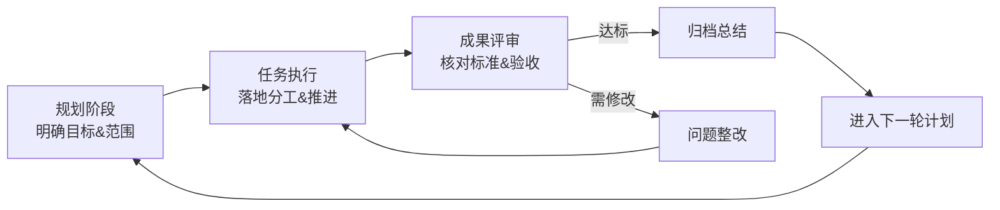

# 工程化工作流

## 核心原则：闭环 PDCA

任何任务必须遵循以下闭环，禁止跳过或压缩任何阶段：

### 阶段 1：规划阶段（Plan）

**目标**：在未动笔写代码或动手执行前，先建立清晰的认知共识。

**必须完成**：
- 明确本次任务的**目标**（要交付什么、解决什么问题）
- 界定**范围**（做什么、不做什么）
- 识别**依赖与风险**（外部接口、阻塞项、技术难点）
- 制定**验收标准**（什么算"完成"、什么算"合格"）
- 输出**执行计划**（步骤拆解、优先级、大致时间估算）

**质量门禁**：
- 若目标模糊 → 向用户追问澄清，禁止进入执行阶段
- 若范围未界定 → 默认列出"不做"清单，与用户确认
- 若验收标准缺失 → 自行提出标准并征求用户同意

### 阶段 2：任务执行（Do）

**目标**：按计划落地，过程中保持透明。

**必须遵守**：
- 严格按规划阶段的步骤推进，不擅自扩大范围
- 每完成一个关键里程碑，主动汇报进度
- 遇到规划外的问题 → 记录并评估影响，必要时暂停并回归规划阶段
- 关键决策留痕（为什么选方案 A 而非方案 B）

**禁止行为**：
- 未与用户确认就改变目标或范围
- 绕过已识别的风险强行推进
- 一次性做完所有事情再汇报

### 阶段 3：成果评审（Check）

**目标**：对照验收标准，客观检查交付物质量。

**必须执行**：
- 逐条核对规划阶段定义的验收标准
- 执行最小验证（代码可编译、测试可通过、功能可运行）
- 自查常见缺陷（边界条件、错误处理、资源泄漏、命名规范）
- 向用户呈现评审结果：哪些达标、哪些不达标

**评审结论**：
- **达标** → 进入阶段 4（归档总结）
- **需修改** → 进入阶段 5（问题整改）

### 阶段 4：归档总结（Act — 正向闭环）

**目标**：沉淀经验，为下一轮循环做准备。

**必须完成**：
- 简要总结本次任务的实际成果
- 记录与初始规划的偏差及原因
- 提炼可复用的经验或教训
- 明确下一阶段的待办项或优化方向

### 阶段 5：问题整改（Act — 负向闭环）

**目标**：定位根因，修复后重新进入评审。

**必须完成**：
- 明确问题根因，而非仅修表面症状
- 评估修复方案的影响范围
- 修复后必须重新执行阶段 3（成果评审）
- 禁止未评审直接标记为"完成"

## 循环触发条件

| 场景 | 动作 |
|------|------|
| 用户提出新任务 | 从阶段 1 开始 |
| 评审不达标 | 进入阶段 5，修复后回到阶段 3 |
| 归档完成 | 自然结束或根据用户指示进入下一轮 |
| 执行中遇到重大范围变更 | 暂停，回到阶段 1 重新规划 |

## 红线规则

1. **无规划不执行**：没有验收标准的工作不算完成
2. **无评审不交付**：未经过阶段 3 检查的成果不交给用户
3. **无闭环不结束**：发现问题必须整改，整改后必须复评
4. **变更需重规**：范围或目标发生实质性变化时，回到阶段 1 重新确认
